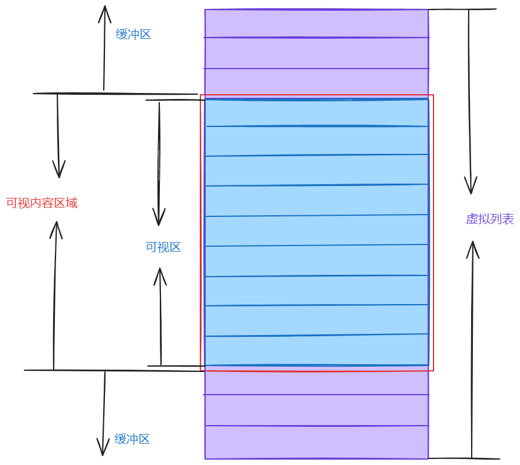

# 虚拟列表 VList

### 概述
::: tip
虚拟列表组件用于展示大量数据时优化性能，通过只渲染可视区域内的元素来减少 DOM 节点数量。
:::

### 实现思路

虚拟列表的核心实现原理如下：

1. 容器结构
   - 外层容器：固定高度，设置 `overflow: auto` 实现滚动
   - 占位容器：高度等于所有列表项总高度，用于形成滚动条
   - 内容容器：通过 `transform: translateY()` 控制偏移，只渲染可视区域的列表项

2. 计算逻辑
   - 可视区域高度 = 容器高度
   - 可视区域能显示的列表项数量 = Math.ceil(可视区域高度 / 列表项高度)
   - 当前滚动位置对应的起始索引 = Math.floor(scrollTop / 列表项高度)
   - 需要渲染的列表项范围 = [起始索引 - 缓冲区大小, 起始索引 + 可视数量 + 缓冲区大小]
   - 内容偏移量 = 起始索引 * 列表项高度

3. 性能优化
   - 使用 `will-change: transform` 开启硬件加速
   - 使用 `requestAnimationFrame` 优化滚动事件处理
   - 添加缓冲区减少滚动时的白屏
   - 列表项高度固定，避免重复计算

4. 功能增强
   - 支持自定义列表项高度
   - 支持列表项点击事件
   - 提供滚动到指定位置的方法
   - 支持自定义渲染内容

### 基础用法

最基础的虚拟列表用法，适用于大数据量的简单列表展示。

<demo src="../demos/v-list/v-list-01-basic.vue"></demo>

### 自定义高度

通过 `itemHeight` 和 `height` 属性可以自定义列表项和容器的高度。

<demo src="../demos/v-list/v-list-02-height.vue"></demo>

### 自定义内容

使用默认插槽可以自定义列表项的内容，插槽提供 `item` 和 `index` 参数。

<demo src="../demos/v-list/v-list-03-custom.vue"></demo>

### API

#### Props

| 参数 | 说明 | 类型 | 默认值 |
| --- | --- | --- | --- |
| data | 列表数据 | array | [] |
| itemHeight | 列表项高度 | number | 50 |
| height | 可视区域高度 | number \| string | 400 |
| bufferSize | 预加载的数量 | number | 10 |

#### Events

| 事件名 | 说明 | 回调参数 |
| --- | --- | --- |
| scroll | 滚动时触发 | event: Event |
| visible-range-change | 可视区域改变时触发 | startIndex: number, endIndex: number |

#### Methods

| 方法名 | 说明 | 参数 |
| --- | --- | --- |
| scrollToIndex | 滚动到指定索引位置 | index: number |
| scrollTo | 滚动到指定位置 | top: number |
| getVisibleRange | 获取当前可视范围 | - |

#### Slots

| 插槽名 | 说明 | 参数 |
| --- | --- | --- |
| default | 自定义列表内容 | { item: any, index: number } | 